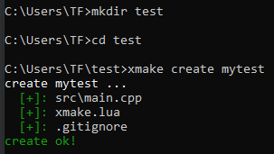
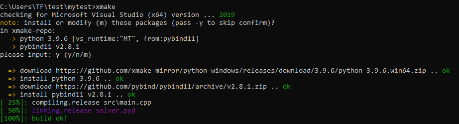
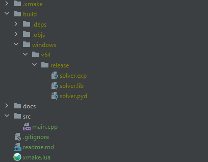
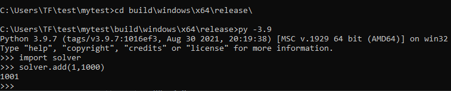

# windows下使用xmake编译pybind11 demo

## xmake
一个基于Lua的轻量级跨平台自动构建工具，速度很快，网址：https://xmake.io/#/zh-cn/

## pybind11
好用的python binding项目，至少tensorflow在用。</br>
网址为：https://pybind11.readthedocs.io/en/stable/basics.html

## xmake编译pybind11项目
由于[xmake-repo](github.com/xmake-io/xmake-repo)的存在，使整个项目的流程变得非常简单。我们只需要安装xmake，然后建立项目，运行xmake命令即可。
具体步骤如下：
1. **创建xmake工程**
   ```commandline
   xmake create mytest
   ```
   

   通过上述脚本创建pybind_demo工程。

2. **目录结构概览**

   新建的工程里面有：

   

3. **添加pybind11官网的exaple.cpp示例代码**

   将pybind11官网的example.cpp代码放到src目录中[main.cpp](src/main.cpp)。这里我将模块命名为”solver“。代码如下所示：

   ```c++
   #include <pybind11/pybind11.h>
   
   namespace py = pybind11;
   
   int add(int i, int j) {
   return i + j;
   }
   
   PYBIND11_MODULE(solver, m) {
   m.doc() = "pybind11 example plugin"; // optional module docstring
   
       m.def("add", &add, "A function which adds two numbers");
   }
   ```

4. **修改[xmake.lua](xmake.lua)文件**

   需要注意上面`PYBIND11_MODULE`里面的变量名要和target对应。

   ```lua
   add_rules("mode.debug", "mode.release")
   add_requires("pybind11")
   set_languages("cxx11")
   set_optimize("fastest")
   
   target("solver")
       add_packages("pybind11")
       set_kind("shared")
       set_extension(".pyd")
       add_files("src/*.cpp")
   ```

5. **执行xmake命令编译**
   
   ```commandline
   xmake
   ```
   

   由于xmake-repo的存在，xmake将会自动下载pybind11需要的依赖。
6. **测试**

   由于上一步默认使用python3.9作为编译库，所以在windows下我们需要在`生成的pyd文件目录`下运行python3.9。
   
   ```commandline
   cd build\windows\x64\release
   py -3.9
   ```
   然后在python中执行：
   ```python
   import solver
   solver.add(1,1000)
   ```   
   结果如下图所示：

      
